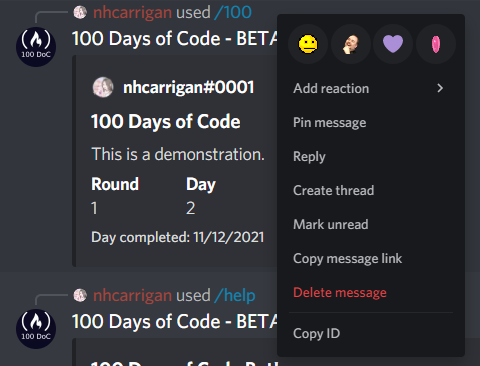
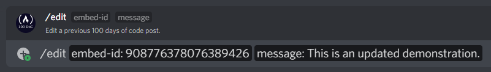
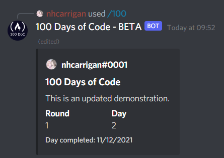
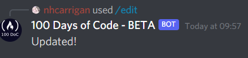

# Edit

The `/edit` command allows you to edit a previous 100 Days of Code post. The bot will modify the post with your new content.

This does require a message ID. You can obtain the message ID by right clicking (long press, on mobile) on the message you want to edit, and selecting "Copy ID".

If you do not see the "Copy ID" option, you may need to enable Developer Mode in your Discord client. Under your settings, select "Advanced" and you will see the toggle for Developer Mode.

The bot will not allow you to edit posts which are not your own.

## Usage

`/edit <id> <message>` will find the message in the channel that matches the `id`. Just like the `/100` command, the `message` parameter can include spaces and line breaks.

## Example

`/edit 855616124788277268 This is an updated demonstration.` will update the existing message with a new embed:

The bot will also respond with a confirmation that your message has been updated.

