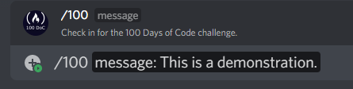
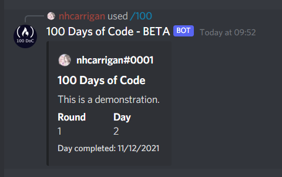

# 100

The `/100` command is used to generate a new 100 Days of Code post. When you use this command, the bot will increase your `day` count by 1. If you have completed a full one hundred days, the bot will set your `day` count to 1 and increase your `round` count by 1.

## Usage

`/100 <message>`, where `message` is the message you would like to appear in your post.

## Example

`/100 This is a demonstration.` will generate this embed:

