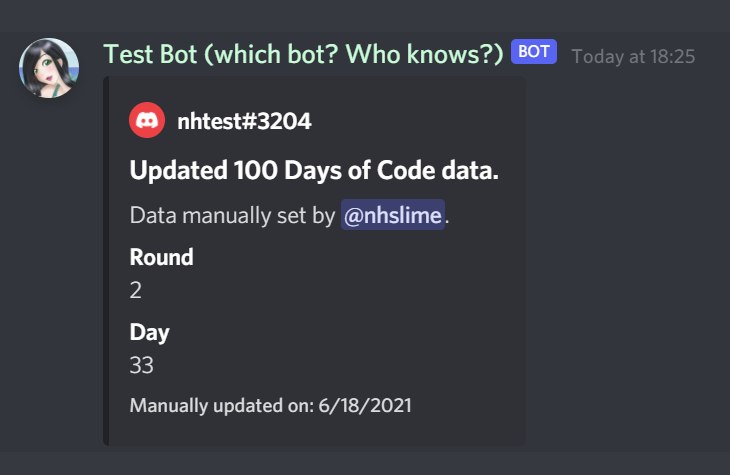

# Override

The `!override` command allows approved moderators to manually set a camper's 100 Days of Code stats.

If you are in the middle of the challenge and would like to start using the bot, let a moderator know where you are at in the challenge and we can set your stats for you.

If you are a moderator and would like the ability to override stats, let nhcarrigan know and you will be added to the bot's approved list.

## Usage

`!override <@user> <round> <day>` will set the stats for the user. `@user` should be a Discord user mention (ping), and `round` and `day` should both be numbers.

## Example

`!override @nhtest 2 33` will update nhtest's data and send the following embed:

