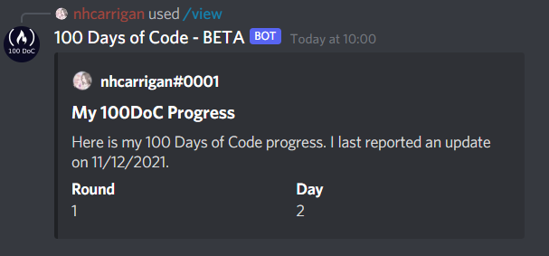

# View

The `!view` command allows you to view your current 100 Days of Code progress. This is helpful if you forgot where you were, or think you might have missed a day.

The resulting embed will show your current `day` and `round`, as well as the date you last reported an update.

## Usage

`!view` will generate the embed. This command takes no parameters.

## Example

`!view` returns an embed similar to this:

